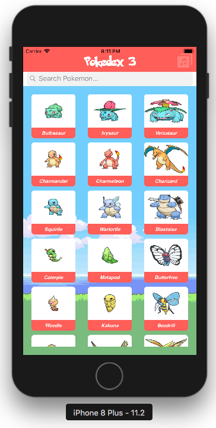
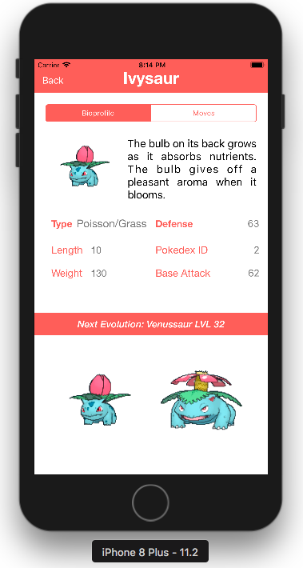

# Pokedex3 App 
  Complete collection of 718 pokemons' profile, stats, & monster type. 
  This app is a Pokedex3 App on iOS phone. However, the layout still built on storyboard UI.
  
  Powered by Swift 4 and Alamofire....
  Go Catch Em' All !!!

## SCREENSHOTS
<p>

</p>

## PROJECT REQUIREMENTS

- iOS 8.0+ / macOS 10.10+ / tvOS 9.0+ / watchOS 2.0+
- Xcode 8.3+
- Swift 3.1+

## DEPENDENCIES INSTALLATION
For network requests, I use [Alamofire](https://github.com/Alamofire/Alamofire) networking library in Swift 4. Here is how to install Alamofire using CocoaPods:

[CocoaPods](http://cocoapods.org) is a dependency manager for Cocoa projects. You can install it with the following command:

```bash
$ gem install cocoapods
```

> CocoaPods 1.1+ is required to build Alamofire 4.0+.

To integrate Alamofire into your Xcode project using CocoaPods, specify it in your `Podfile`:

```ruby

source 'https://github.com/CocoaPods/Specs.git'
platform :ios, '10.0'
use_frameworks!

target 'pokedex3' do
    pod 'Alamofire', '~> 4.7'
end
```

Then, run the following command:

```bash
$ pod install
```

## Pokedex3... What this project does :

#### View Layer
- Single Activity Model with reusable Fragments.
- Display pokemons in a collection view
- Show pokemon stats and information details.
- Implement pokemon name search using searchbar.
- Pokemon music player and volume control

#### Data and Domain Layer
- Fetch pokemon information/data (json) from [POKEAPI](https://pokeapi.co)
- Parse CSV of pokemon name list

## DEPRECATION 

Quite a lot of data is missing from the V1 PokeAPI. Pokemon detail doesn't show correct stats & info anymore. 

**As of January 2015, no new data will be added to the v1 API.**

See [This blog post for more information](http://phalt.co/if-you-have-data-they-will-consume-it).

## Assets 

- [Pokemon Icon](https://www.google.com.sg/url?sa=i&rct=j&q=&esrc=s&source=images&cd=&ved=2ahUKEwjG2vDasPvbAhVMVH0KHVSxCmkQjhx6BAgBEAM&url=http%3A%2F%2Fwww.iconsalot.com%2Fshow%2Fbutton-ui-20-app-pack-6-by-blackvariant%2Fpokemon-icon.html&psig=AOvVaw3TZ2iZ70uiIOnca8KiVRDU&ust=1530447857732739)
- [Pokemon Images](https://www.pokemon.com/us/legal/)
